# Akashic 项目架构说明

最后更新：2026-06-05

本文面向新线程交接、架构评审和后续实现拆分，说明 Akashic 当前系统如何工作、各模块边界、哪些已经实现、哪些只是 control plane、哪些仍未 cutover，以及如何设计“基于 QQ 群消息的 RAG”。

权威状态以以下文件和 live verifier 为准：

- `docs/sdd/PROJECT_STATUS.md`
- `docs/sdd/REMAINING_GO_MIGRATION.md`
- `docs/sdd/OPEN_ISSUES.md`
- `docs/sdd/LIVE_CHECKS.md`
- `.codex-goal-verifier.json`

## 1. 项目定位

Akashic 是一个多平台、长期运行的 agent runtime。它的核心目标不是只“接入一个聊天机器人”，而是把消息接入、状态机、发送、任务生命周期、媒体资产、审计、RAG/记忆和 AI 执行拆成可观察、可回滚、可逐步 cutover 的系统。

当前项目正在从 Python 单体运行态迁移到 Go + Python 分层架构：

- Go 负责确定性 runtime 和 control plane。
- Python 负责 AI runtime、模型调用、prompt、工具、OCR/VLM、RAG 策略和业务推理。
- Dashboard 负责只读观察和 operator entrypoint，不直接拥有控制逻辑。
- NATS JetStream 是当前已实现且推荐的外部 MQ 路径。

## 2. 完整功能全景

本节按“完整产品功能”呈现 Akashic，而不是按代码目录呈现。每个功能都标注当前状态。

状态说明：

- `已实现`：代码和本机验证已有，当前可作为事实。
- `部分实现`：已有核心链路，但仍有平台 blocker、凭证、cutover 或范围限制。
- `control plane 已有`：已有 plan/readiness/audit/preflight，但还没有真实执行器。
- `计划中`：架构已设计，但还没有落地实现。
- `Python-owned`：明确保留在 Python，不算 Go 迁移未完成。

### 2.1 多平台消息接入

| 功能 | 说明 | 当前状态 |
| --- | --- | --- |
| QQ / NapCat 接入 | 多账号 QQ 消息接收、OneBot/NapCat adapter、route gate | 部分实现 |
| QQ 私聊文本发送 | Go local outbox worker 可发送私聊文本 | 已实现 |
| QQ 群文本发送 | 已有 smoke，但当前全局群发开关关闭 | 部分实现 |
| QQ 文件发送 | 第二账号 file、第一账号 private file 已可 gated 放开 | 部分实现 |
| QQ 图片发送 | native NapCat image 仍失败 | 未完成，受平台 blocker 阻塞 |
| Observe-only 群 | 群消息只观察不回复，runtime hard block | 已实现 |
| Telegram Bot | Go adapter 和 verification runbook 已有 | 未完成，缺 `TELEGRAM_BOT_TOKEN` |

用户视角：

- 系统能观察指定 QQ 群。
- 系统能向允许的 QQ 私聊/部分 file route 发送。
- 系统不会误向 observe-only 群回复。
- Telegram 需要 token 到位后才能真正启用。

### 2.2 消息知识库与 RAG

| 功能 | 说明 | 当前状态 |
| --- | --- | --- |
| QQ 群 raw message store | 原始群消息进入 inbox/raw store | 已实现基础 |
| 群消息 RAG dataset | 每个群绑定 dataset、checkpoint、index state | 计划中/部分 diagnostics 已有 |
| 文本消息 RAG ingest | QQ 群文本增量 chunk + embedding | 计划中 |
| 图片/文件入 RAG | OCR/VLM/file parse 后进入索引 | 计划中，依赖 media enrichment |
| 多模态 RAG | 图片、表情包、视频、语音、文件统一 source graph | 计划中 |
| GraphRAG/entity timeline | 人、项目、论文、文件、群事件关系图 | 计划中，建议轻量落地 |
| RAG eval | retrieval/generation/citation/safety 指标体系 | 文档设计已补充，执行 harness 待做 |

用户视角：

- 目标是能问“群里之前怎么说的”“某个人最近说了什么”“这个文件对应哪个讨论”。
- 回答必须带消息、文件、图片或论文来源。
- 不应该跨群泄露知识。

### 2.3 记忆系统

| 功能 | 说明 | 当前状态 |
| --- | --- | --- |
| Source memory | 原始消息、媒体、论文、网页、工具结果 | 部分实现 |
| Episodic memory | 按时间和事件组织的群/项目记忆 | 计划中 |
| Semantic memory | 从 source 抽取稳定事实和总结 | Python-owned，计划增强 |
| Entity memory | 人、群、项目、论文、文件的档案和 timeline | 计划中 |
| Procedural memory | 如何操作项目、工具、runbook | 部分已有文档形态 |
| Preference memory | 兴趣、关注人、mute topic、推送偏好 | 计划中 |

用户视角：

- 系统应该记住事实、事件、流程和偏好，但不能把派生摘要当作唯一真相。
- 每条重要记忆都应该能追溯到 source。

### 2.4 主动推送

| 功能 | 说明 | 当前状态 |
| --- | --- | --- |
| arXiv 论文发现 | 定期按兴趣搜索论文 | 计划中，需要 MCP/tool |
| 论文自动阅读 | PDF parse、摘要、相关性评分 | 计划中，Python-owned |
| 论文主动推送 | 每日/每周 digest 通过 outbox 推送 | 计划中 |
| QQ 群定时总结 | 按小时/天总结群消息 | 计划中 |
| 关注人动态 | 跟踪特定 QQ 用户发言、文件、链接、被提及 | 计划中 |
| 推送治理 | 去重、quiet hours、mute、max items | 计划中 |

用户视角：

- 系统应该主动告诉你“今天值得读的论文”“这个群今天发生了什么”“你关注的人有什么新动态”。
- 所有主动推送都必须走 scheduler + AgentJob + outbox gate。

### 2.5 AgentJob 与异步任务

| 功能 | 说明 | 当前状态 |
| --- | --- | --- |
| AgentJob lifecycle | job、event、lease、pressure、dead-letter | 已实现 |
| Python worker status | heartbeat、fencing、cleanup、startup prune | 已实现 |
| Knowledge planner | Go 负责 recurring knowledge job admission | 已实现，剩长期观察 |
| NATS external lease | temp NATS smoke、preflight、launcher bundle、cutover diff | 已实现验证，但未 production cutover |
| production result-ack owner switch | agent_job owner 切到 NATS result-ack | 未完成 |

用户视角：

- 长任务应该可观察、可重试、可诊断。
- AI 执行仍在 Python，但生命周期由 Go 管。

### 2.6 媒体资产

| 功能 | 说明 | 当前状态 |
| --- | --- | --- |
| Media registry | QQ/TG 图片、文件、视频等资产登记 | 已实现 |
| Content diagnostics | 判断内容是否可读、forbidden、缺 root | 已实现 |
| HTTP/HTTPS recovery | approval-bound cache recovery | 已实现 |
| QQ/TG private-source recovery | 平台会话态重拉私有源 | 未完成 |
| OCR/VLM enrichment | 图片/视频/文件解析后进入 RAG | Python-owned，计划中 |
| Retention cleanup | 媒体保留策略和 metadata cleanup | 已实现基础 |

### 2.7 Scheduler / Proactive

| 功能 | 说明 | 当前状态 |
| --- | --- | --- |
| Scheduler state | job snapshot、lease、CRUD、completion | 已实现 |
| Scheduler recovery | Python startup recovery 写回 Go | 已实现 |
| Proactive deterministic state | quota、seen/rejection、drift、tick log | 已实现 |
| Proactive semantic decision | 是否主动行动、说什么、调什么工具 | Python-owned |
| 自动 worker control | autoscaling/concurrency/priority executor | control plane 已有，执行器未实现 |

### 2.8 Dashboard / Operator control

| 功能 | 说明 | 当前状态 |
| --- | --- | --- |
| Runtime overview | 大量 Go read-model 结构化展示 | 已实现 |
| Queue topology | provider、owner、ack owner、capability matrix | 已实现 |
| QQ cutover route matrix | sendable/policy blocked/platform blocker | 已实现 |
| Control audit | approval ledger、mutation ledger、policy | 已实现 |
| Manual executor | 自动修改配置/调并发/切 owner | 未实现 |

### 2.9 运维与评测

| 功能 | 说明 | 当前状态 |
| --- | --- | --- |
| Unified goal verifier | `.codex-goal-verifier.json` current state | 已实现 |
| Runtime smoke scripts | QQ、Telegram、NATS、dashboard、media 等 | 部分实现 |
| RAG offline eval | retrieval/generation/citation/safety benchmark | 计划中 |
| RAG online feedback | useful/not useful/correction/mute | 计划中 |
| Cost/latency monitoring | query/index/job 成本和延迟 | 计划中 |

## 3. 总体架构

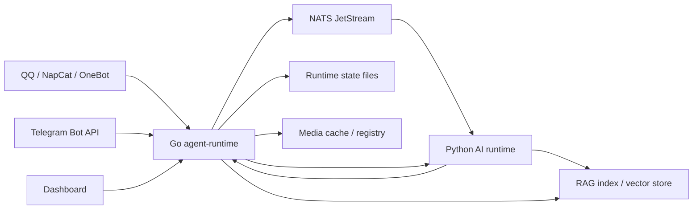

核心数据流分为四条：

1. inbound：平台消息进入 Go，标准化、去重、写 inbox/raw store、生成 media asset、更新 observe/knowledge diagnostics。
2. outbox：AI 或工具产生发送请求，写入 Go outbox，Go worker 或外部 lease worker 根据 gate 执行发送。
3. agent_job：Go 负责 job admission、lease、event、dead-letter、readiness、external lease plan；Python worker 执行 AI 任务。
4. dashboard/control：Go 暴露只读 diagnostics、plan、preflight、approval/audit；Dashboard 消费这些 read-model。

## 4. Go runtime 职责

Go runtime 是系统的确定性基础设施层。

已经实现或基本收口的 Go-owned 能力：

- normalized message envelope
- inbox/raw message store
- inbound dedupe
- outbox delivery state machine
- outbox event stream
- send ledger
- dead letters
- media asset registry
- media content diagnostics
- HTTP/HTTPS media recovery executor
- media retention diagnostics/plan/cleanup
- receiver status / lease / stale cleanup
- agent worker status / fencing / heartbeat / cleanup / startup prune
- scheduler state / lease / CRUD / complete / recovery bridge
- proactive deterministic state
- AgentJob lifecycle / event / pressure / worker coverage / readiness
- queue topology / queue backend capability matrix
- NATS external lease smoke and preflight support
- operator approval ledger
- control mutation audit ledger
- runtime overview aggregation
- dashboard-facing read-models

Go 不应该承接的部分：

- LLM/provider 调用
- prompt/context/reasoning
- Python tool execution
- OCR/VLM/image generation
- embedding/rerank/RAG 策略实验
- provider-specific AI fallback

## 5. Python runtime 职责

Python runtime 是 AI 执行层。

它负责：

- 接入模型供应商和 provider fallback。
- 构造 prompt、上下文、工具调用和 agent reasoning。
- 执行 image generation、OCR、VLM、RAG ingest、memory extraction。
- 运行 knowledge worker、image worker、outbox compatibility worker 等历史执行器。
- 在迁移期间把 worker heartbeat/status 上报给 Go。

Python 不应该继续独占的部分：

- 长期任务状态机。
- outbox/inbox 生命周期。
- receiver lease。
- worker lease/fencing。
- media registry 和审计。
- control mutation approval/audit。
- dashboard runtime read-model。

迁移原则是：AI 策略留 Python，确定性状态和审计迁 Go。

## 6. 平台接入层

### QQ / NapCat / OneBot

当前 QQ 是最复杂的接入面。

已经实现：

- Go OneBot/NapCat adapter。
- 多账号 QQ route 识别。
- 私聊文本、群文本、部分 file route 的 Go outbox 发送。
- account-kind gate。
- account-conversation-kind gate。
- observe-only group hard block。
- 全局 QQ group send manual toggle。
- QQ route matrix verifier。

当前 live 边界：

- `outbox_execution_owner=go_local_outbox_worker`
- `outbox_execution_scope=account_conversation_kind_gated`
- `qq_group_send_enabled=false`

未完成：

- 所有 image route 仍被 native 平台 blocker 卡住。
- 第一账号 group file 仍未恢复。
- 群发总开关当前保持关闭。

这意味着 QQ 不是“完全没迁”，而是已经做了分层 gate 的部分 cutover。

### Telegram

已经实现：

- Go Telegram adapter 代码。
- runtime-config token visibility。
- verification runbook。

未完成：

- `TELEGRAM_BOT_TOKEN` 未配置。
- `getMe` / receiver / 收发 smoke 未完成。
- 当前 `receiver_statuses.telegram=0`。

Telegram 当前是凭证缺失，不是架构缺口。

## 7. Inbound 架构

Inbound 负责接收平台事件并形成可重放、可诊断、可进入 RAG/Memory 的消息事实。

处理流程：

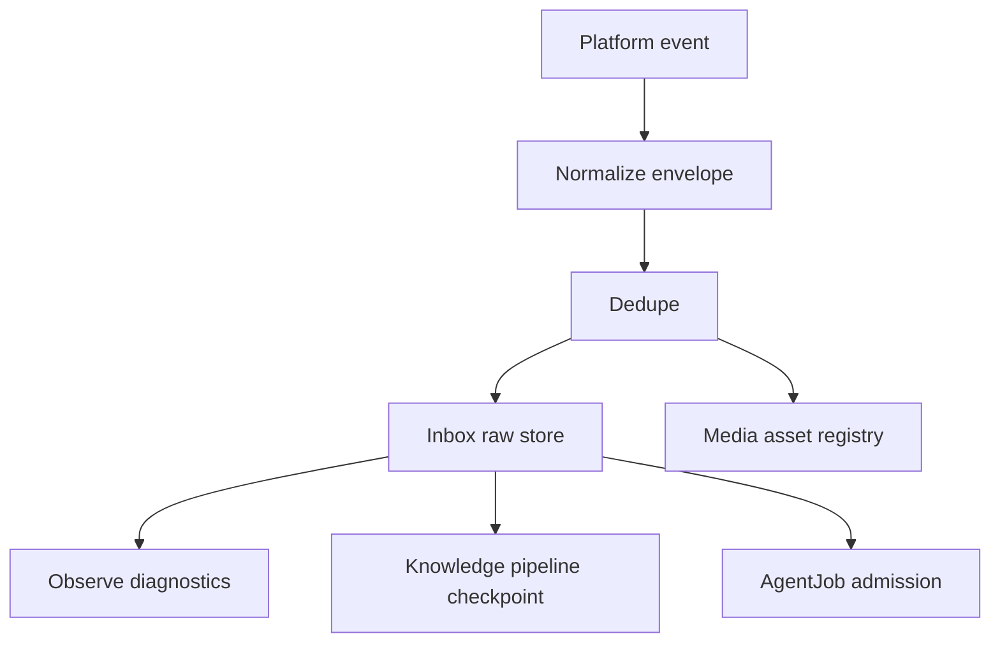

关键设计：

- 原始消息必须保留 platform id、account、conversation type、conversation id、sender、timestamp、seq。
- 去重按 platform/account/conversation/message id 做 TTL 和持久化记录。
- 媒体不直接塞进 RAG，先进入 media asset registry。
- observe-only 群只采集，不回复。
- knowledge pipeline 只读取 inbox/checkpoint，不直接依赖平台回调。

## 8. Outbox 架构

Outbox 是“待发送消息队列 + 状态机 + 审计层”。

处理流程：

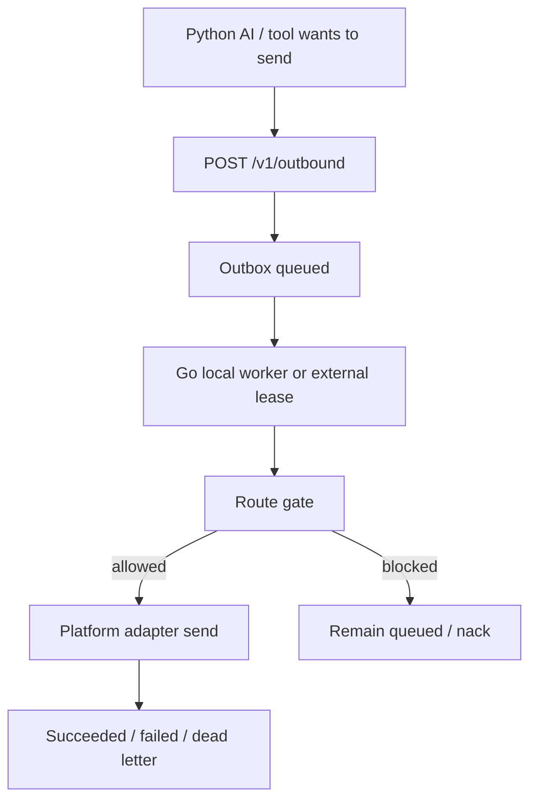

Outbox 当前已经支持：

- delivery state machine
- lease/retry/dead-letter
- account throttling
- route gate
- event stream
- pressure diagnostics
- runtime overview detail

当前重要 gate：

- 全局 kind gate：例如只放 `text`。
- account-kind gate：例如第二账号允许 `file`。
- account-conversation-kind gate：例如第一账号 private 允许 `file`。
- group send toggle：当前全局 group send 关闭。
- observe-only group hard block：observe-only 群不能回复。

最新设计重点：

- external lease 路径也必须复用同一套 outbox route gate。
- 切到 NATS external lease 后，不能绕过 QQ image/file blocker。

## 9. AgentJob 架构

AgentJob 是 AI/知识/图片/RAG 等异步任务的生命周期层。

Go 负责：

- job records
- events
- lease
- stale/dead-letter
- pressure
- worker coverage
- readiness/plan
- external lease result-ack preflight

Python 负责：

- 实际执行模型、工具、RAG ingest、image generation 等任务。

当前 production 状态：

- `agent_job_execution_owner=python_ai_worker_state_store_lease`
- `agent_job_ack_owner=go_state_store_api`
- `agent_job_external_lease_ready=false`
- `agent_job_external_lease_decision=blocked`

已经实现但未 production cutover：

- temp NATS smoke
- isolated cutover preflight
- approval-bound preflight API
- launcher preflight
- launcher bundle
- cutover diff
- external lease outbox gate parity

剩余：

- production runtime 还没注入 external queue / strict-token / result-ack flags。
- owner 还没切到 NATS result-ack 路径。

## 10. MQ / NATS 架构

当前 MQ 策略：

- 本地 state-store 是当前 production 运行态。
- NATS JetStream 是已实现且推荐的外部 MQ。
- Redis Streams / RabbitMQ 是 planned-only。

NATS 的目标职责：

- 承接 AgentJob external lease。
- 支持 result-ack。
- 支持 worker 横向扩展。
- 支持更清晰的 ack/nack/retry/dead-letter 语义。

为什么不是现在就全切：

- 需要 production `QueueDSN`。
- 需要 strict lease token。
- 需要 worker coverage。
- 需要 approval-bound preflight。
- 需要 owner switch。
- 需要 rollback path。

## 11. Scheduler 架构

Scheduler 已经基本迁入 Go control plane。

Go 负责：

- scheduler job snapshot
- upsert/delete
- execution lease
- complete mutation
- recurring reschedule
- one-shot delete
- diagnostics

Python 保留：

- tick loop 中具体执行逻辑。
- 需要 AI/tool 的具体任务。

当前剩余不是状态机缺口，而是长期运行观察。

## 12. Proactive 架构

Proactive 的确定性状态已经迁到 Go。

Go 负责：

- deliveries count
- seen/rejection cooldown
- cleanup
- anyaction quota
- drift state
- background context mark
- tick log state

Python 保留：

- 语义候选选择。
- 是否主动发起动作的 AI 判断。
- 工具和模型调用。

真实 autoscaling / concurrency / priority executor 还没实现。

## 13. Media 架构

Media 分为三层：

1. registry：Go 记录资产 id、source、content readiness、retention、metadata。
2. content access：Go 判断能否读取、是否 forbidden、是否需要 recovery。
3. enrichment：Python 做 OCR/VLM/embedding/summary。

已经实现：

- media registry
- content diagnostics
- content access plan
- recovery plan/preflight
- HTTP/HTTPS recovery executor
- control mutation audit
- dashboard parity

未完成：

- QQ/Telegram 私有源会话态抓取。
- 后台自动重拉。
- 恢复后自动触发 AI enrichment。

设计原则：

- Go 管资产事实、cache、审计和访问策略。
- Python/provider worker 管私有源凭证、平台细节和 AI 解析。

## 14. Dashboard 架构

Dashboard 是只读 projection，不是控制面 owner。

它消费：

- `/v1/runtime-overview`
- `/v1/queue-backend`
- `/v1/queue-topology`
- `/v1/media-assets/*`
- `/v1/agent-job-*`
- `/v1/control-*`

当前 tracked runtime-overview drilldown 已基本结构化，不再依赖 raw JSON。

Dashboard 允许做：

- read-only tables
- parity verifier
- fallback projection
- plan/preflight links

Dashboard 不应做：

- 直接修改 runtime config。
- 直接触发 cutover。
- 绕过 approval 执行 mutation。
- 自己维护一套与 Go 分叉的 runtime truth。

## 15. Control Plane / Approval / Audit

控制面当前主要是 plan、preflight、approval、audit。

已经实现：

- operator approvals ledger
- control mutations ledger
- allowlist policy
- preflight
- runtime overview summary/card/detail
- dashboard parity

未实现：

- capacity / priority / cutover 的真实自动 executor。

未来 executor 必须满足：

- 需要 active approval。
- 必须写 control mutation audit。
- 必须可 rollback。
- 必须限流。
- 必须能解释 side effect。

## 16. 当前未完成清单

### Hard blockers

1. `telegram_token_missing`

   `TELEGRAM_BOT_TOKEN` 未注入，Telegram backend 不能完成 `getMe + receiver + send/receive smoke`。

2. `qq_image_native_platform_blocker_unresolved`

   QQ image 在 native NapCat/OneBot 对照里仍失败，因此不能声称 Go image cutover 完成。

### Still not fully cut over

- QQ / NapCat rich media full cutover。
- Telegram backend。
- production AgentJob external lease result-ack。

### Control plane present, executor missing

- worker autoscaling executor。
- concurrency control executor。
- priority executor。
- media private-source fetch executor。

### Python-owned, not migration debt

- LLM/provider 调用。
- prompt/context/reasoning。
- tool execution。
- OCR/VLM/image generation。
- RAG algorithm and strategy experiments。

## 17. QQ 群消息 RAG 目标

你希望依据 QQ 群消息做 RAG。目标不是简单把群聊天全部塞进向量库，而是构建一套可追溯、可增量、可过滤、能处理图片/文件、能尊重 observe-only 和隐私边界的群知识系统。

目标能力：

- 从 QQ 群持续采集消息。
- 按群、主题、时间、发送人、消息类型建立知识源。
- 支持文本、图片 OCR/VLM、文件内容解析。
- 自动增量 chunk、embedding、index。
- 查询时能结合当前会话上下文检索群历史。
- 回答必须带来源引用。
- 支持过期、删除、屏蔽、重建索引。

## 18. QQ 群 RAG 数据流设计

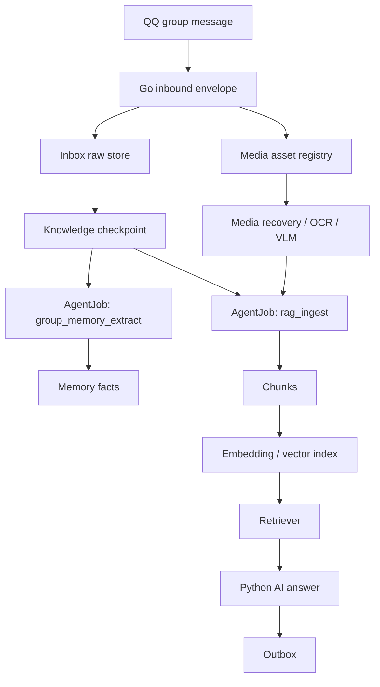

### Step 1: message capture

Go 接收 QQ 群消息后写入 inbox。

每条消息必须保留：

- `platform=qq`
- `account_id`
- `conversation_type=group`
- `group_id`
- `message_id`
- `sender_id`
- `sender_display_name`
- `timestamp`
- `seq`
- `message_type`
- `text`
- `media_asset_ids`
- `reply_to/message_refs`
- `raw_event`

这一层只记录事实，不做 AI 判断。

### Step 2: observe target policy

每个 QQ 群应该有 observe target 配置：

- 是否采集。
- 是否允许回复。
- 是否进入 RAG。
- 是否允许图片/文件入库。
- 数据保留周期。
- 是否脱敏。
- 是否排除某些 sender。

建议新增或扩展配置：

```toml
[[observe_targets]]
platform = "qq"
account_id = "1049511700"
conversation_type = "group"
conversation_id = "27234224"
observe_only = true
reply_allowed = false
rag_enabled = true
rag_dataset = "qq-group-27234224"
media_ingest_enabled = true
retention_days = 180
```

### Step 3: checkpoint-driven ingestion

Go 使用 checkpoint 记录每个群的 RAG ingest 进度。

推荐 checkpoint key：

```text
qq:{account_id}:group:{group_id}:rag_ingest
qq:{account_id}:group:{group_id}:group_memory_extract
```

每轮 planner 根据 checkpoint 和 inbox latest seq 生成 jobs：

- `group_memory_extract`
- `rag_ingest`
- `media_enrichment`
- `rag_reindex`

Go 负责 admission 和 cursor，Python 负责实际抽取和 embedding。

### Step 4: message normalization for RAG

RAG 不应该直接索引 raw message。

需要生成 normalized document：

```json
{
  "doc_id": "qq:1049511700:group:27234224:msg:123456",
  "dataset": "qq-group-27234224",
  "source": "qq_group_message",
  "text": "normalized message text",
  "sender_id": "123",
  "sender_name": "Alice",
  "timestamp": "2026-06-05T10:00:00+08:00",
  "message_id": "123456",
  "conversation_id": "27234224",
  "media_asset_ids": [],
  "citations": [
    {
      "type": "qq_message",
      "message_id": "123456",
      "timestamp": "2026-06-05T10:00:00+08:00"
    }
  ]
}
```

### Step 5: chunking strategy

QQ 群消息通常短、碎、上下文强，不能只按单条消息 chunk。

推荐三种 chunk：

1. message chunk

   单条重要消息直接入库，适合公告、链接、结论。

2. conversation window chunk

   按时间窗口或 reply chain 聚合，例如 5 到 20 分钟内同一主题的连续讨论。

3. summary chunk

   对一天或一个事件做摘要，保留引用到原始 message ids。

推荐 chunk metadata：

- group_id
- account_id
- sender_ids
- time_start/time_end
- message_ids
- media_asset_ids
- topic_tags
- confidence
- source_kind
- retention_class

### Step 6: media enrichment

图片和文件不要直接进入向量库。

处理流程：

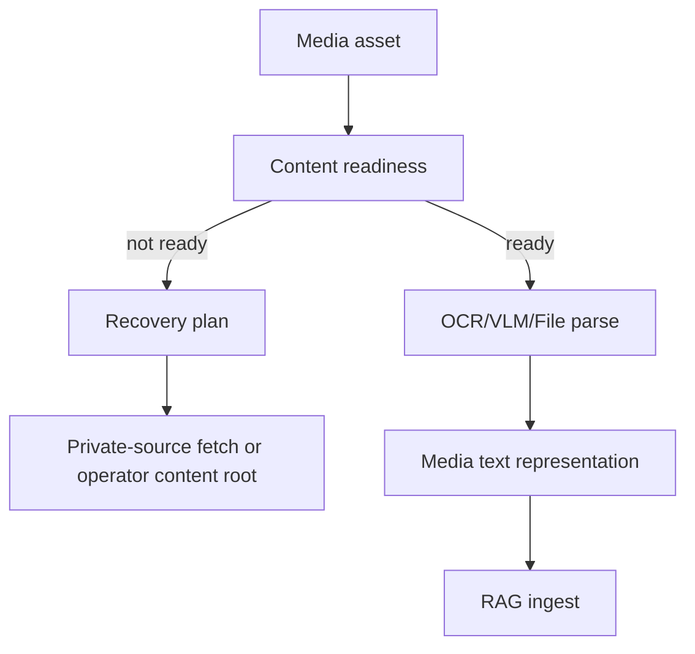

对于图片：

- OCR 提取文字。
- VLM 生成简短描述。
- 保留原始 media asset citation。

对于文件：

- 先判断类型。
- 文本/PDF/Office 可解析为文档片段。
- 大文件异步处理。
- 不支持类型只保留 metadata。

当前未实现部分：

- QQ 私有源自动重拉。
- Telegram 私有源自动重拉。
- 恢复后自动触发 media enrichment。

## 19. QQ 群 RAG 查询设计

查询路径：

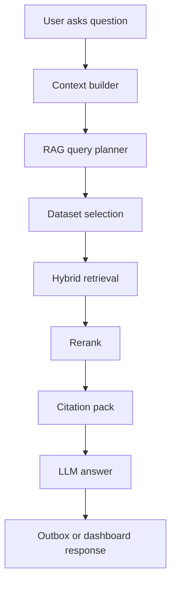

### Dataset selection

查询时不要默认搜所有群。

选择规则：

- 当前对话所在群优先。
- 用户明确提到群名/主题时选择对应 dataset。
- 需要跨群知识时才多 dataset 检索。
- observe-only 群可以进入知识，但是否允许在群里回复要由 route policy 决定。

### Retrieval strategy

建议 hybrid retrieval：

- vector similarity：语义召回。
- keyword/BM25：人名、群名、术语、ID、链接。
- time filter：最近消息优先或指定时间段。
- sender filter：某些管理员/高可信 sender 提权。
- thread/reply-chain boost：保留上下文连续性。

### Rerank strategy

Python 执行 rerank，因为它属于 RAG 策略实验。

rerank feature：

- semantic relevance
- recency
- sender authority
- message density
- media enrichment confidence
- exact keyword hit
- citation completeness

### Answer contract

回答必须带来源。

最小引用形式：

```text
根据 2026-06-05 10:00 左右群 27234224 的讨论，结论是...

来源：
- qq group 27234224 message 123456, Alice, 2026-06-05 10:00
- qq group 27234224 message 123459, Bob, 2026-06-05 10:03
```

如果来源不足，必须回答“不确定”，而不是编造。

## 20. QQ 群 RAG 写入模型

建议新增或规范这些 Go-owned records：

### `rag_source_documents`

存 normalized source document。

字段：

- `doc_id`
- `dataset`
- `source_kind`
- `platform`
- `account_id`
- `conversation_type`
- `conversation_id`
- `message_ids`
- `media_asset_ids`
- `text`
- `metadata`
- `created_at`
- `updated_at`

### `rag_chunks`

存 chunk metadata，不一定存 embedding。

字段：

- `chunk_id`
- `doc_id`
- `dataset`
- `text`
- `token_count`
- `message_id_range`
- `time_range`
- `citation_refs`
- `embedding_status`
- `index_status`

### `rag_ingest_jobs`

通过 AgentJob 管生命周期。

job types：

- `rag_ingest`
- `rag_reindex`
- `media_enrichment`
- `group_memory_extract`

### `rag_dataset_state`

每个 QQ 群 dataset 的状态。

字段：

- `dataset`
- `group_id`
- `enabled`
- `latest_inbox_seq`
- `checkpoint_seq`
- `last_ingest_at`
- `index_ready`
- `chunk_count`
- `pending_jobs`
- `failed_jobs`

## 21. Go / Python 在 RAG 中的边界

Go 负责：

- inbox source truth
- checkpoint
- job admission
- dataset state
- chunk metadata
- media asset linkage
- audit
- dashboard diagnostics
- deletion/retention policy

Python 负责：

- text cleaning strategy
- topic detection
- chunking strategy implementation
- embedding call
- rerank call
- LLM answer generation
- OCR/VLM
- file parsing
- evaluation

这样做的原因：

- Go 保证状态可靠、可追溯、可恢复。
- Python 保留算法迭代速度。
- RAG 策略会频繁调整，不适合硬写进 Go。

## 22. QQ 群 RAG 安全与治理

必须有这些约束：

1. observe-only 不等于可回复。

   群消息可以进入 RAG，但 outbox 是否回复必须继续走 route gate。

2. source citation 必须可追溯。

   每个 chunk 至少能追溯到 message id 或 media asset id。

3. 支持删除和过期。

   群消息、媒体和 chunk 必须遵守 retention policy。

4. 支持敏感信息过滤。

   私聊、token、手机号、账号等需要脱敏策略。

5. 支持 per-group dataset 隔离。

   默认不要跨群泄露知识。

6. 支持 operator audit。

   批量 reindex、删除 dataset、扩大群范围都应该有 audit。

## 23. QQ 群 RAG 实施阶段

### Phase 1: read-only diagnostics

目标：

- 每个群是否 rag_enabled 可见。
- inbox latest seq / checkpoint seq 可见。
- pending/failed jobs 可见。
- dataset 是否 ready 可见。

主要改动：

- 扩展 observe target config。
- 扩展 knowledge pipeline diagnostics。
- Dashboard 增加 QQ group RAG table。

### Phase 2: text-only incremental ingest

目标：

- 只处理文本消息。
- 按 checkpoint 增量生成 `rag_ingest` job。
- Python worker chunk + embedding。
- Go 记录 dataset/index state。

不处理：

- 图片。
- 文件。
- 自动回答。

### Phase 3: query-time retrieval

目标：

- Python answer pipeline 能按当前 QQ 群选择 dataset。
- 检索结果带 citation。
- 回答走 outbox gate。

### Phase 4: media enrichment

目标：

- 图片 OCR/VLM 入库。
- 文件解析入库。
- media asset 和 chunk 双向引用。

前置：

- private-source recovery executor 设计清楚。

### Phase 5: governance and rebuild

目标：

- dataset rebuild。
- chunk deletion。
- retention cleanup。
- index drift diagnostics。
- eval dashboard。

## 24. 建议的下一步切片

如果要开始做 QQ 群 RAG，建议第一轮不要直接做 embedding。

推荐第一轮切片：

**QQ group RAG dataset/readiness diagnostics**

范围：

- 在 observe target 上增加 `rag_enabled`、`rag_dataset`。
- Go diagnostics 暴露每个群的 RAG dataset binding。
- runtime overview/dashboard 展示：
  - group id
  - rag enabled
  - dataset
  - inbox latest seq
  - checkpoint seq
  - lag
  - worker coverage
  - index ready unknown/false
- 不调用 embedding。
- 不写向量库。
- 不触发 AI。

验收：

- 当前 QQ observe groups 能看到 dataset readiness。
- 没配置 dataset 的群显示 `not_configured`。
- 已配置但无 checkpoint 的群显示 `pending_initial_ingest`。
- Dashboard 是只读表格。

第二轮再做 text-only `rag_ingest` job admission。

## 25. MCP capability layer

Akashic 还需要一个 MCP capability layer，用来接入外部知识源、研究工具和个人工作流工具。MCP 不应该绕过 runtime 状态机直接修改业务状态，也不应该直接向 QQ/Telegram 推送消息。

MCP 在架构中的位置：

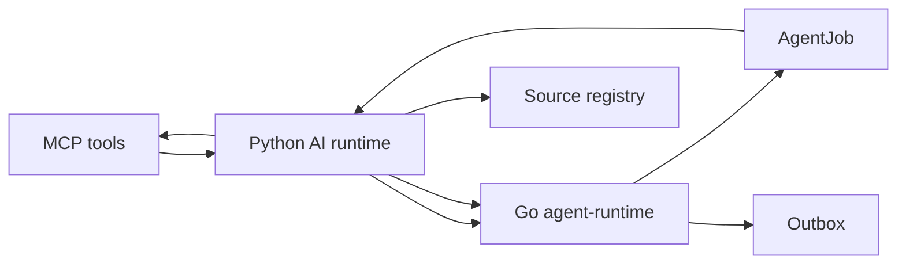

MCP 负责：

- 调用外部 API。
- 拉取论文、网页、RSS、仓库、issue、docs 等资料。
- 读取 PDF / HTML / metadata。
- 给 Python AI runtime 提供工具能力。

MCP 不负责：

- 自己决定什么时候推送。
- 自己绕过 approval/outbox 直接发 QQ/Telegram。
- 自己保存 runtime truth。
- 自己替代 Go scheduler、AgentJob、audit。

推荐边界：

- Go scheduler 决定什么时候运行。
- Go AgentJob 记录任务生命周期。
- Python 调 MCP 获取资料并生成摘要。
- Go outbox 负责最终推送和 gate。
- Dashboard 只显示状态、订阅、最近推送和失败原因。

## 26. arXiv 兴趣论文自动阅读与主动推送

目标是让系统定期发现你感兴趣的 arXiv 论文，自动阅读、筛选、总结，并通过 outbox 主动推送给你。

### 25.1 核心能力

需要支持：

- interest profile：你的研究兴趣、关键词、作者、机构、会议方向、负样例。
- scheduled discovery：定时检索 arXiv。
- paper fetch：拉取 metadata、abstract、PDF。
- paper reading：解析 PDF、提取方法、贡献、实验、局限。
- ranking：按兴趣相关性、 novelty、可信度排序。
- digest：生成每日/每周论文简报。
- push：通过 QQ/Telegram/private channel 主动推送。
- feedback：你可以标记 interested / not interested / follow author / mute topic。

### 25.2 数据流

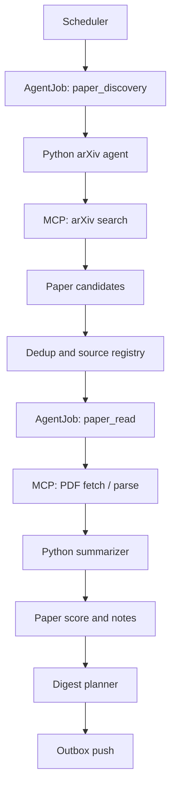

### 25.3 Suggested MCP tools

第一阶段可以接这些 MCP/tool capability：

- `arxiv.search`
- `arxiv.get_paper`
- `pdf.fetch`
- `pdf.extract_text`
- `web.fetch`
- `citation.lookup`
- `semantic_scholar.lookup`

如果没有现成 MCP，可以先做 Python tool wrapper，再通过同一 AgentJob/outbox 架构接入。

### 25.4 Interest profile

建议保存一个用户兴趣配置：

```yaml
paper_watch:
  enabled: true
  schedule: "daily"
  timezone: "Asia/Shanghai"
  queries:
    - "vision language model efficient inference"
    - "token pruning multimodal large language model"
    - "RAG agent memory"
  authors:
    follow: []
    mute: []
  topics:
    boost:
      - "token compression"
      - "multimodal RAG"
      - "agent memory"
    mute:
      - "unrelated medical imaging"
  push:
    channel: "qq_private"
    max_items_per_digest: 8
```

### 25.5 Paper records

Go-owned source registry 应保存论文事实：

- `paper_id`
- `source=arxiv`
- `arxiv_id`
- `title`
- `authors`
- `abstract`
- `categories`
- `published_at`
- `updated_at`
- `pdf_url`
- `discovered_at`
- `dedupe_key`
- `read_status`
- `score`
- `push_status`

Python-owned analysis 应保存或回写：

- one-line summary
- contribution bullets
- method
- experiments
- limitations
- why_relevant
- recommended_action
- confidence

### 25.6 Reading output contract

每篇论文的摘要不应只是“这篇文章提出了一个方法”。建议固定格式：

```text
标题：
一句话结论：
为什么与你相关：
核心方法：
实验和证据：
主要局限：
值得读的优先级：
原文链接：
```

推送 digest 示例：

```text
今日 arXiv 论文筛选：8 篇候选，建议读 3 篇

1. Paper title
相关性：高
原因：和 token compression / multimodal inference 直接相关
结论：...
链接：...
```

### 25.7 Go / Python / MCP 边界

Go 负责：

- schedule
- job lifecycle
- source registry
- dedupe
- digest push state
- retry/dead-letter
- outbox push
- dashboard diagnostics

Python 负责：

- 调 MCP。
- PDF/text parsing orchestration。
- LLM summarization。
- ranking/rerank。
- interest matching。
- feedback learning。

MCP 负责：

- arXiv/search/PDF/web/citation 的外部读取。
- 不负责调度、状态机、推送。

### 25.8 Push safety

主动论文推送必须有这些限制：

- 每日最大推送数。
- 同一论文不重复推送。
- 低置信度只进 dashboard，不主动打扰。
- 支持 quiet hours。
- 支持 unsubscribe/mute topic。
- 推送必须走 outbox gate。

## 27. QQ 群消息总结与关注人动态推送

除了 QQ 群消息 RAG，系统还需要主动总结群消息，并推送你关注的人动态。

这和 RAG 的关系：

- RAG 是 query-time retrieval。
- 群总结是 scheduled summarization。
- 关注人动态是 entity/person tracking。

它们共享 inbox、checkpoint、media asset、AgentJob 和 outbox，但输出目标不同。

### 26.1 定时群消息总结

目标：

- 每天/每几小时总结指定 QQ 群发生了什么。
- 区分重要结论、待办、争议、链接、文件、图片。
- 保留原始 message citation。
- 只推送给你，不自动回群。

数据流：

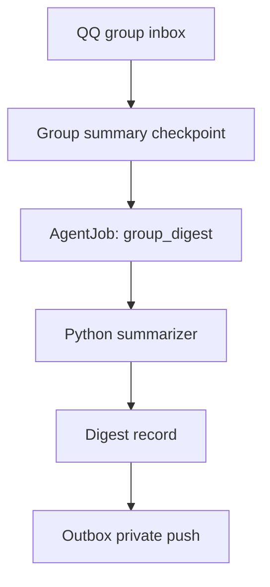

建议 summary window：

- hourly：高频群或事件期。
- daily：普通群。
- weekly：低频群。

summary 应包含：

- 时间范围。
- 消息数量。
- 活跃成员。
- 关键话题。
- 重要结论。
- 待跟进事项。
- 链接/文件/图片摘要。
- 关注人动态。
- 引用 message ids。

### 26.2 Summary job model

建议新增 job types：

- `qq_group_digest`
- `qq_group_digest_backfill`
- `qq_group_topic_cluster`

Go 负责：

- summary checkpoint。
- 按群和时间窗口创建 job。
- 防重复。
- 记录 digest push state。
- outbox 推送。

Python 负责：

- topic clustering。
- 摘要生成。
- 去噪。
- 重要性判断。
- action item 抽取。

### 26.3 Digest record

建议保存：

- `digest_id`
- `group_id`
- `account_id`
- `window_start`
- `window_end`
- `message_count`
- `participant_count`
- `topic_count`
- `summary_text`
- `important_messages`
- `followed_people_mentions`
- `media_refs`
- `source_message_ids`
- `push_status`

### 26.4 关注的人动态

目标：

- 你可以配置关注的人。
- 系统定时汇总这些人在群里的发言、提到的项目、发出的文件/链接、被别人提及的上下文。
- 支持重要动态即时推送，普通动态进入日报。

关注人配置示例：

```yaml
people_watch:
  enabled: true
  people:
    - label: "Alice"
      qq_ids: ["123456"]
      aliases: ["alice", "A同学"]
      groups: ["27234224", "3219982"]
      push_mode: "digest"
    - label: "Bob"
      qq_ids: ["987654"]
      aliases: ["bob"]
      groups: ["27234224"]
      push_mode: "important_only"
  rules:
    immediate_keywords:
      - "上线"
      - "事故"
      - "论文"
      - "实验结果"
    daily_digest_time: "21:30"
```

### 26.5 Person activity extraction

数据来源：

- 关注人自己发的消息。
- 别人 at 或提到关注人的消息。
- reply chain 中与关注人相关的上下文。
- 关注人发送的文件、图片、链接。

抽取字段：

- `person_id`
- `group_id`
- `activity_type`
- `message_ids`
- `time_range`
- `summary`
- `importance`
- `keywords`
- `media_asset_ids`
- `action_required`

activity types：

- `posted_update`
- `shared_file`
- `shared_link`
- `mentioned_by_others`
- `asked_question`
- `answered_question`
- `decision_or_commitment`
- `risk_or_blocker`

### 26.6 Push policy

主动推送必须分级：

- immediate：高重要性、含显式关键词、直接与你相关。
- daily digest：普通关注人动态。
- dashboard only：低置信度或噪声。

默认建议：

- 群总结每天推一次。
- 关注人动态默认进日报。
- 只有强规则命中才即时推送。
- 所有推送走 private outbox，不回 observe-only 群。

### 26.7 Integration with QQ group RAG

群总结和关注人动态应反向进入 RAG。

写入方式：

- 原始消息继续作为 primary source。
- digest 作为 summary source。
- person activity 作为 entity timeline source。

检索时：

- 问“这个群最近聊了什么”优先召回 digest。
- 问“某人最近有什么动态”优先召回 person activity timeline。
- 问具体事实时回落到原始 message chunks。

### 26.8 Dashboard views

建议新增只读 dashboard：

- Paper Watch
  - 今日候选数
  - 已读论文数
  - 推荐论文数
  - 推送状态
  - 最近失败原因

- QQ Group Digest
  - group
  - window
  - message count
  - topic count
  - pushed/not pushed
  - summary preview

- People Watch
  - person
  - groups
  - recent activity count
  - immediate alerts
  - last digest time

这些 dashboard 只读，不直接触发推送。手动重跑 digest 或 reindex 应走 approval-bound control mutation。

## 28. Akashic 记忆系统组织方式

Akashic 的 memory system 不应该只等同于一个向量库。它应该是一个多层记忆系统：原始事实由 Go 保存，语义抽取和总结由 Python 生成，检索索引可以重建，最终回答必须能追溯到原始来源。

### 27.1 Memory layers

推荐分成六层：

1. Source memory

   原始消息、文件、图片、视频、网页、论文、工具结果。它是所有记忆的 source of truth。

2. Episodic memory

   按时间组织的事件记忆，例如某个 QQ 群某天讨论了什么、某个人某段时间做了什么、某次工具执行得到什么结果。

3. Semantic memory

   从原始消息和事件中抽取出的稳定事实、概念、结论、FAQ、项目知识、术语解释。

4. Entity memory

   围绕人、群、项目、论文、工具、文件、任务组织的实体档案和时间线。

5. Procedural memory

   “如何做事”的流程记忆，例如某个项目怎么启动、某个 verifier 怎么跑、某类故障如何排查。

6. Preference memory

   你的兴趣、偏好、关注的人、关注主题、推送频率、mute 规则和反馈记录。

### 27.2 Storage ownership

Go-owned：

- source record registry
- inbox raw message store
- media asset registry
- checkpoint
- memory extraction job lifecycle
- memory/RAG dataset state
- retention/deletion/audit
- citation id mapping

Python-owned：

- semantic extraction
- summarization
- topic modeling
- entity resolution strategy
- embedding/rerank
- memory confidence scoring
- conflict resolution strategy

Index-owned：

- vector index
- sparse/BM25 index
- graph/entity index
- full-text search index

关键原则：

- source memory 是不可替代事实。
- semantic memory 是可重建派生物。
- embedding index 是可重建加速结构。
- answer 不能只引用 semantic summary，必须能回溯到 source memory。

### 27.3 Memory record model

建议统一 memory record：

```json
{
  "memory_id": "mem_...",
  "memory_type": "source|episodic|semantic|entity|procedural|preference",
  "scope": {
    "platform": "qq",
    "conversation_type": "group",
    "conversation_id": "27234224",
    "dataset": "qq-group-27234224"
  },
  "content": "memory text",
  "source_refs": [
    {
      "type": "qq_message",
      "message_id": "123456",
      "timestamp": "2026-06-05T10:00:00+08:00"
    }
  ],
  "entities": ["person:alice", "project:akashic"],
  "confidence": 0.82,
  "freshness": "2026-06-05T10:00:00+08:00",
  "retention_class": "default",
  "visibility": "private",
  "created_by_job_id": "agent_job_..."
}
```

### 27.4 Memory update rules

记忆不能无脑追加，否则会产生重复、冲突和污染。

需要支持：

- append：新事实。
- merge：同一事实多来源合并。
- supersede：旧结论被新结论替代。
- decay：长期未被使用或低置信度记忆降权。
- delete：按用户请求或 retention policy 删除。
- quarantine：低可信、敏感或冲突内容隔离，不进入默认检索。

冲突处理：

- 保留多个候选事实。
- 标记 source 和时间。
- 让回答阶段说明不确定性。
- 不让低置信度 summary 覆盖高可信 source。

## 29. 生产级 RAG 链路设计

面向大厂工程实践和顶会论文常见方向，RAG 不应只是 dense vector search。建议采用 source-grounded、hybrid retrieval、rerank、query planning、citation-first、eval-driven 的链路。

### 28.1 End-to-end chain

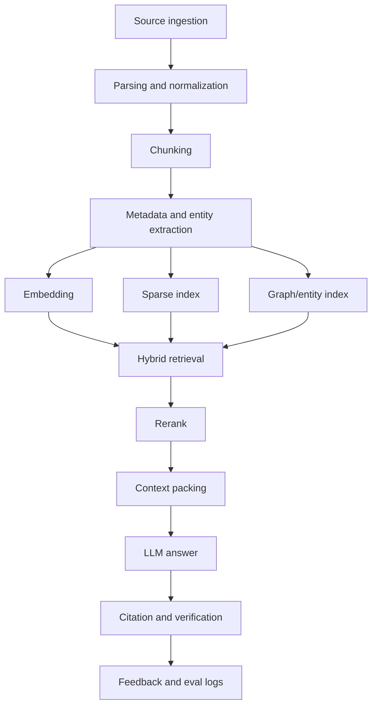

### 28.2 Ingestion

Ingestion 必须先做 source normalization。

每个 source item 需要：

- stable id
- source type
- timestamp
- author/sender
- scope
- raw text
- parsed text
- media refs
- citation refs
- visibility policy
- retention policy

### 28.3 Chunking

不同数据源用不同 chunking。

QQ 群消息：

- 短消息按 topic/time window 聚合。
- reply chain 单独保留。
- 重要单条消息可以单独成 chunk。

论文：

- abstract、introduction、method、experiment、limitation、conclusion 分段。
- 表格和图注单独抽取。
- citation context 单独保留。

文档/文件：

- 按标题层级和段落 chunk。
- 表格要转成结构化文本。
- 代码块保留语言和路径。

图片/视频：

- OCR/VLM/ASR 结果进入 text chunk。
- 原 media asset 保留为 citation，不直接丢失。

### 28.4 Indexing

建议至少三类索引：

1. Dense vector index

   用于语义召回。

2. Sparse/BM25 index

   用于人名、项目名、术语、ID、链接、文件名等精确召回。

3. Entity/graph index

   用于“某人最近动态”“某项目相关讨论”“某论文被哪些群提到”这类关系查询。

可选增强：

- multi-vector per document
- summary vector + passage vector
- temporal index
- authority/sender weighting
- multimodal embedding

### 28.5 Query planning

检索前需要 query planner，而不是直接把用户问题塞进向量库。

Planner 判断：

- 查哪个 dataset。
- 查原始消息还是 summary。
- 是否需要时间过滤。
- 是否需要人/群/项目 entity filter。
- 是否需要 media/text/论文专用索引。
- 是否需要跨源检索。

示例：

- “昨晚群里说的部署问题是什么” -> QQ group digest + raw message window。
- “Alice 最近在忙什么” -> people activity timeline + raw citations。
- “这篇论文和我们项目有什么关系” -> paper summary + project memory + QQ discussion。

### 28.6 Retrieval and rerank

推荐 retrieval：

- dense top-k
- sparse top-k
- metadata filter
- time-aware boost
- entity boost
- source authority boost

推荐 rerank：

- cross-encoder 或 LLM rerank。
- MMR 去冗余。
- citation completeness boost。
- freshness boost。
- exact entity match boost。

### 28.7 Context packing

把检索结果塞给 LLM 前要做 context packing：

- 合并同一 thread 的消息。
- 去重相似 chunk。
- 保留 source citation。
- 按问题组织 evidence。
- 控制 token budget。
- 区分 primary evidence 和 background evidence。

### 28.8 Answer verification

回答前后要检查：

- 每个关键结论是否有 source。
- 是否引用了过期或低可信 chunk。
- 是否跨群泄露。
- 是否把表情包/玩笑误当事实。
- 是否把 summary 当成 primary source。

如果证据不足，应回答不确定。

## 30. QQ 群多模态数据处理

QQ 群不是纯文本数据源。RAG 需要能处理文本、文件、图片、表情包、视频、语音、链接和回复链。

### 29.1 Text messages

处理方式：

- 保留原文。
- 做轻量清洗：去掉无意义重复空白、标准化 URL、保留 emoji。
- 不要过度改写口语。
- 按时间窗口和 topic 聚合。

特殊处理：

- @某人 -> entity mention。
- 回复消息 -> thread edge。
- 链接 -> URL source candidate。
- 代码/命令 -> procedural memory candidate。

### 29.2 Files

文件类型：

- PDF
- Word/Excel/PPT
- Markdown/text
- code/archive
- unknown binary

处理方式：

- Go 记录 media asset 和 file metadata。
- Python file parser 提取文本。
- 表格保持结构化。
- 大文件异步解析。
- unsupported 文件只进入 metadata，不进入默认 RAG。

索引策略：

- 文件名和发送人进 sparse index。
- 正文进 dense/sparse index。
- 文件摘要进 semantic memory。
- 文件本体作为 citation。

### 29.3 Images

图片可能是截图、照片、论文图、聊天截图、报错截图、二维码、表情包。

处理方式：

- Go 记录 media asset。
- content ready 后 Python 执行 OCR。
- VLM 生成图像描述。
- 如果是截图，保留 OCR text 和 layout hint。
- 如果是论文图/实验图，提取标题、坐标轴、表格、图注。

索引策略：

- OCR text 进 sparse/dense index。
- VLM caption 进 dense index。
- media asset id 作为 citation。
- 原图不直接复制进回答，除非 dashboard 或 UI 需要展示。

### 29.4 Memes and stickers

表情包不能简单丢弃。它们在群里经常承载态度、情绪、梗和上下文。

处理方式：

- 记录 sticker/image asset。
- OCR 提取表情包文字。
- VLM 生成情绪/意图描述，例如 joking、agreement、sarcasm、surprise。
- 不把表情包描述当作事实。
- 可作为 conversation sentiment 或 reaction evidence。

索引策略：

- 表情包文字可检索。
- 情绪标签可用于总结。
- 默认不进入事实型 semantic memory。
- 只在问“当时大家什么反应”时召回。

### 29.5 Videos

视频处理成本高，必须异步。

处理流程：

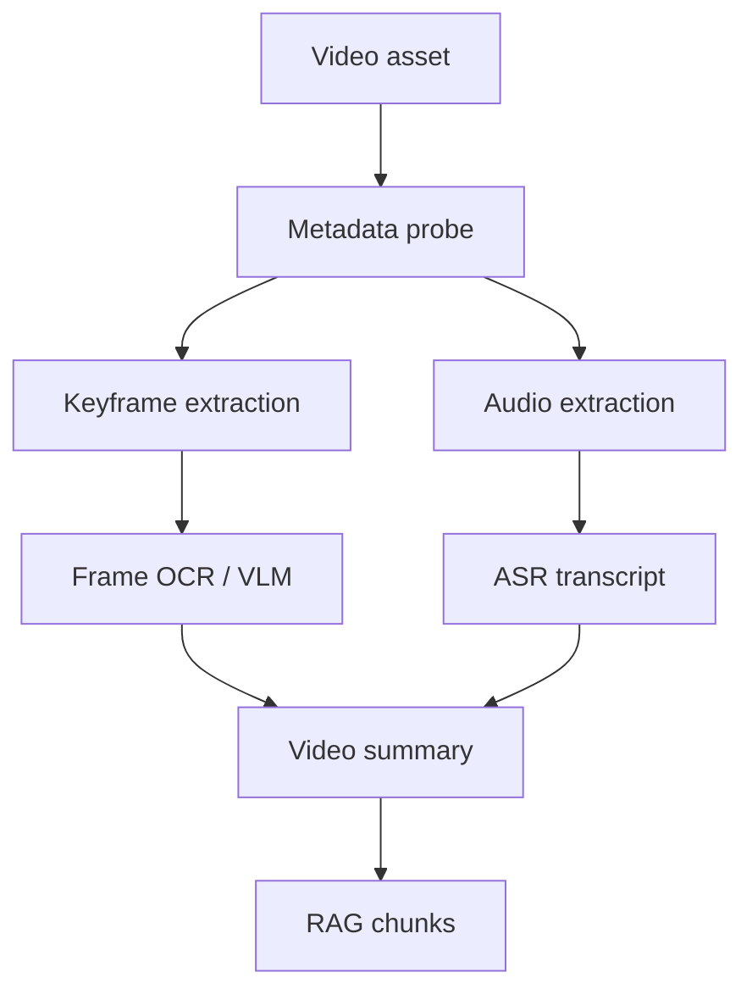

处理方式：

- 提取 metadata：duration、size、format。
- 抽关键帧。
- 对关键帧做 OCR/VLM。
- 对音频做 ASR。
- 生成时间戳级 summary。
- 大视频只做摘要，不默认全文级细粒度索引。

索引策略：

- ASR transcript 按时间 chunk。
- keyframe caption 按 timestamp chunk。
- video summary 作为高层 chunk。
- 原视频 asset 作为 citation。

### 29.6 Voice messages

如果 QQ 语音可采集：

- 保存 media asset。
- ASR 转文本。
- 说话人默认为 sender。
- ASR 低置信度时不进入事实 memory，只进入 source memory。

### 29.7 Links and web pages

群里的链接应作为外部 source candidate。

处理方式：

- 抽 URL。
- 抓取 title/description。
- 可选抓正文。
- 记录 fetch time。
- 防止重复抓取。
- 对登录态/私有链接只保留 metadata。

### 29.8 Multimodal source fusion

一个群事件可能包含文本 + 图片 + 文件 + 表情包。

融合策略：

- 按时间窗口聚合。
- reply chain 优先。
- 同一 sender 连续消息合并。
- 文件/图片与前后文本绑定。
- 生成 event-level episodic memory。

示例：

```text
10:00 Alice: 新实验结果在这里
10:01 Alice: [image: chart.png]
10:02 Bob: 3080 上也能跑吗？
10:03 Alice: [file: result.xlsx]
```

应形成一个 event memory，而不是四个孤立 chunk。

## 31. RAG 评测体系

RAG 评测必须拆成 retrieval、context、generation、citation、freshness、安全和系统性能，不应只看“回答像不像”。

### 30.1 Evaluation datasets

需要维护多类评测集：

1. Golden QA

   人工标注问题、标准答案、必须命中的 source message/file/paper。

2. Time-sliced QA

   按时间窗口提问，验证系统能否找最近信息。

3. Entity QA

   围绕关注人、项目、论文、群主题提问。

4. Multimodal QA

   答案依赖图片、文件、表情包、视频或语音。

5. Negative QA

   故意问不存在或证据不足的问题，验证系统是否拒答。

6. Privacy / scope QA

   验证不会跨群泄露、不会把 observe-only 群内容错误推送回群。

### 30.2 Retrieval metrics

核心指标：

- Recall@K
- Precision@K
- MRR
- nDCG@K
- Hit Rate@K
- Source Coverage
- Entity Recall
- Time-window Recall

定义：

- Recall@K：标准证据是否出现在前 K 个检索结果中。
- MRR：第一个正确证据排得越靠前越好。
- nDCG@K：高相关证据是否整体靠前。
- Source Coverage：答案所需的多个 source 是否都被召回。
- Time-window Recall：是否召回正确时间范围内的消息。

### 30.3 Rerank metrics

指标：

- rerank nDCG lift
- top-1 evidence accuracy
- redundancy rate
- MMR diversity
- stale evidence rate

目标：

- rerank 后正确证据更靠前。
- 同一 source 重复 chunk 更少。
- 过期证据被降权。

### 30.4 Generation metrics

指标：

- Answer correctness
- Faithfulness
- Completeness
- Unsupported claim rate
- Refusal accuracy
- Contradiction rate

定义：

- Faithfulness：回答中的每个关键断言是否能被 evidence 支撑。
- Unsupported claim rate：没有来源支撑的断言比例。
- Refusal accuracy：证据不足时是否拒答。
- Contradiction rate：是否与 source 冲突。

### 30.5 Citation metrics

指标：

- Citation precision
- Citation recall
- Citation grounding rate
- Citation freshness
- Source traceability

要求：

- 每个重要结论至少有一个 source ref。
- 引用能回到 message id、file id、paper id 或 media asset id。
- summary source 不能替代 primary source。

### 30.6 Multimodal metrics

图片：

- OCR character accuracy
- OCR useful text recall
- VLM caption relevance
- chart/table extraction correctness

文件：

- parse success rate
- table preservation score
- section recall
- attachment citation accuracy

视频/语音：

- ASR word error rate
- keyframe coverage
- timestamp grounding accuracy
- video summary faithfulness

表情包：

- meme text OCR recall
- reaction classification accuracy
- false factualization rate

其中 false factualization rate 很重要：表情包表达情绪，不应被当作事实来源。

### 30.7 Freshness and incremental metrics

指标：

- ingest lag
- checkpoint lag
- indexing latency
- stale answer rate
- update propagation time
- delete propagation time

定义：

- ingest lag：消息进入 inbox 到生成 RAG source 的延迟。
- indexing latency：source 到可检索的延迟。
- stale answer rate：回答用了已被更新或删除的信息的比例。
- delete propagation time：删除或 retention 后索引清理耗时。

### 30.8 Safety and policy metrics

指标：

- cross-group leakage rate
- private-source leakage rate
- observe-only reply violation
- sensitive-info exposure rate
- unauthorized push rate
- mute/quiet-hours violation

这些指标必须作为上线 gate，而不是事后日志。

### 30.9 System metrics

指标：

- query latency p50/p95/p99
- retrieval latency
- rerank latency
- embedding throughput
- indexing throughput
- job success rate
- dead-letter rate
- cost per indexed item
- cost per answered query

### 30.10 Human evaluation rubric

每个回答可按 1 到 5 分评：

- correctness
- groundedness
- usefulness
- completeness
- citation quality
- freshness
- privacy compliance

推荐上线门槛：

- Faithfulness >= 95%
- Citation grounding rate >= 95%
- Recall@10 >= 85%
- Unsupported claim rate <= 3%
- Cross-group leakage rate = 0
- Observe-only reply violation = 0

这些阈值是初始建议，后续应按真实群数据和任务类型调整。

### 30.11 Online feedback

上线后应收集：

- user clicked source
- user marked useful/not useful
- user corrected answer
- user asked follow-up
- user muted topic/person
- user requested delete

这些 feedback 进入 preference memory 和 eval dataset，不直接覆盖 source memory。

## 32. RAG 技术路线和具体做法

本节把 Akashic 的 RAG 从“用向量库检索”扩展成完整工程链路。设计参考了经典 RAG、GraphRAG、RAPTOR、Self-RAG、ColBERT、RAGAS/ARES、ColPali/VisRAG、LightRAG 和 Vespa phased ranking 等论文/技术报告，但落地时按 Akashic 的数据特点做取舍。

### 31.1 不把 RAG 等同于向量检索

标准 RAG 可以拆成四层：

1. source layer

   QQ 群消息、文件、图片、视频、论文、网页、工具结果。

2. index layer

   dense vector、sparse/BM25、entity graph、summary tree、多模态索引。

3. retrieval layer

   query planning、粗排、精排、context packing、citation assembly。

4. generation layer

   LLM 根据 evidence 回答，并做 groundedness / citation 检查。

Akashic 的原则：

- 原始 source 由 Go 保管。
- index 可以重建，不作为唯一事实。
- Python 做 retrieval strategy、rerank、LLM answer。
- 回答必须能追溯到 message/file/media/paper id。

### 31.2 Offline indexing pipeline

离线/异步入库链路：

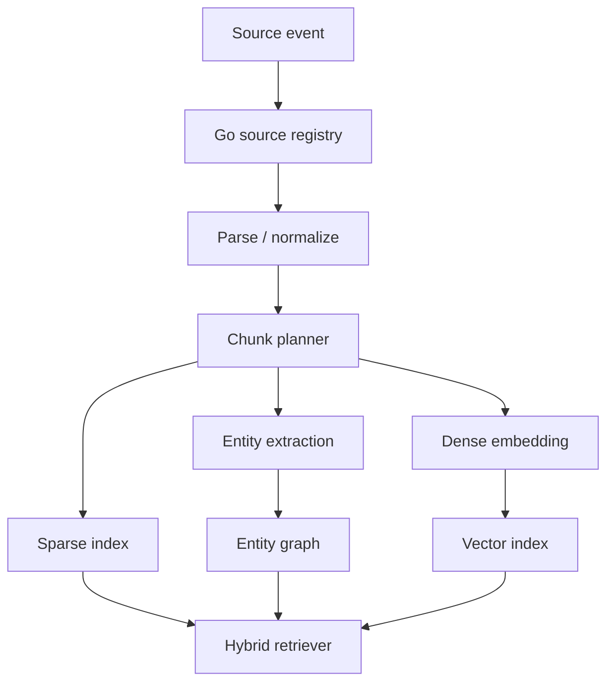

具体做法：

- Go 写入 source registry、checkpoint、media asset 和 job lifecycle。
- Python worker 拉取待处理 source。
- 文本走 normalization + chunking。
- 图片走 OCR/VLM。
- 视频走 ASR + keyframe VLM。
- 文件走 parser。
- 生成 chunk、entity、summary 和 citation。
- dense/sparse/entity index 分别更新。

每一步必须有 status：

- `pending_parse`
- `parsed`
- `pending_embedding`
- `indexed`
- `failed`
- `quarantined`

### 31.3 Online serving pipeline

在线问答链路：

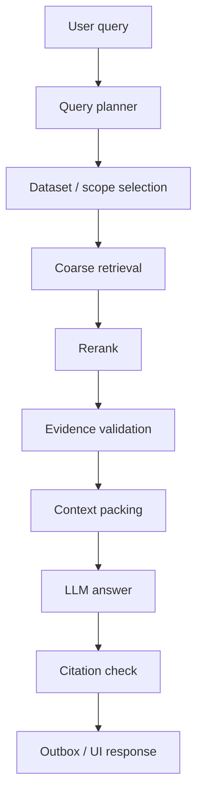

核心步骤：

- Query planner 先判断要查哪个群、哪个人、哪个时间段、是否需要论文/文件/图片。
- Coarse retrieval 同时跑 dense、sparse 和 graph/entity recall。
- Rerank 用 cross-encoder、ColBERT-style late interaction 或 LLM rerank。
- Context packing 去重、合并 thread、保留 citation。
- Answer 阶段要求引用 source，不足则拒答。

### 31.4 粗排和精排

粗排负责“召回尽量全”，精排负责“排得足够准”。

粗排建议：

- BM25 / sparse：召回人名、群名、术语、ID、文件名、URL。
- Dense vector：召回语义相关内容。
- Entity graph：召回关注人、项目、论文、群事件关系。
- Time filter：召回指定时间窗口。
- Summary tree：召回长时间跨度的摘要节点。

精排建议：

- 第一阶段：规则打分，按时间、群、sender、exact match、source type 做轻量加权。
- 第二阶段：cross-encoder 或 ColBERT-style rerank。
- 第三阶段：LLM rerank 只用于高价值、低频问题，避免成本失控。

推荐默认：

```text
coarse topK:
  dense: 80
  sparse: 80
  entity/time/thread: 40
merge and dedupe: 120
rerank topK: 20
context pack: 6-12 evidence blocks
```

为什么不用纯 dense：

- QQ 群里大量问题依赖人名、ID、文件名、群号、时间、缩写。
- dense embedding 对这些 exact token 不稳定。
- 表情包、截图 OCR、文件名和链接更适合 sparse 或 metadata filter。

为什么不用纯 BM25：

- 群聊口语表达变化大。
- 用户问题和原始消息常常不共词。
- 论文/文件摘要需要语义召回。

### 31.5 是否使用知识图谱

结论：**使用轻量知识图谱，但不把知识图谱作为第一阶段的唯一 RAG 主干。**

适合用知识图谱的场景：

- 关注人的动态。
- 项目、论文、群、文件、任务之间的关系。
- “某人最近在忙什么”。
- “这个文件是谁发的，后来谁讨论过”。
- “某篇论文和哪些群讨论相关”。
- 跨群、跨时间、跨来源的 entity timeline。

不适合一开始重度使用知识图谱的原因：

- 群消息噪声大，entity extraction 容易错。
- 口语、昵称、表情包会造成实体歧义。
- 图谱构建和维护成本高。
- 如果没有 source-grounded citation，图谱会放大错误事实。
- 图谱对短文本事实问答不一定优于 hybrid retrieval。

推荐落地方式：

1. Phase 1：entity metadata，不做复杂图推理。

   抽取 `person`、`group`、`paper`、`file`、`project`、`topic`。

2. Phase 2：entity timeline。

   记录某人/某项目在时间上的活动摘要。

3. Phase 3：light graph recall。

   查询时用图谱扩展候选 source，例如从 person 找到相关群和文件。

4. Phase 4：GraphRAG-style community summary。

   对稳定项目/长期主题构建 community summary，适合全局问题。

知识图谱的优点：

- 能处理跨文档、跨时间、跨群关系。
- 适合“人/项目/论文/事件”的长期记忆。
- 能提升 query planning 和 scope selection。
- 能支撑关注人动态和项目 timeline。

知识图谱的风险：

- 抽取错误会产生错误边。
- 维护成本比向量库高。
- 强依赖 entity resolution。
- 需要严格 source citation 才能避免幻觉。

Akashic 的策略：

- 图谱先做辅助召回和 timeline，不做唯一 truth。
- 每条 graph edge 必须能追溯 source refs。
- 低置信度 entity/edge 进入 quarantine，不进入默认检索。

### 31.6 RAPTOR / hierarchical summary 是否使用

结论：**使用分层摘要，但只作为长上下文和长期群总结的辅助索引。**

适合场景：

- 一天/一周 QQ 群总结。
- 长论文、长 PDF、长 thread。
- “最近这个群主要聊了什么”。
- “过去一个月某项目进展如何”。

不适合场景：

- 需要精确引用某条消息。
- 需要查文件名、ID、数字、命令。
- 新消息刚进来但摘要未更新。

落地方式：

- leaf：原始 message/file/media chunks。
- middle：topic window summary。
- root：daily/weekly group digest。
- query 时同时召回 summary 和 leaf。
- 如果 answer 引用 summary，必须展开到 leaf source refs。

### 31.7 Self-RAG / corrective RAG 是否使用

结论：**使用其中的自检思想，不直接照搬完整训练框架。**

Akashic 可以实现：

- retrieve decision：判断当前问题是否需要检索。
- evidence sufficiency check：证据是否足够。
- answer support check：回答是否被 evidence 支撑。
- corrective retrieval：证据不足时换 query 或扩大时间范围。

不直接做完整 Self-RAG 训练的原因：

- 当前系统重点是工程 runtime 和个人知识库。
- 训练专用反思 token 成本高。
- 使用 LLM-based verifier 和规则检查更实际。

### 31.8 Multi-vector / late interaction 是否使用

结论：**高价值数据可用 late interaction 或 multi-vector，默认先 hybrid retrieval + rerank。**

适合 late interaction 的数据：

- 论文段落。
- 技术文档。
- 长文件。
- OCR 后结构复杂的截图。

不建议默认全量使用的原因：

- 索引成本和存储成本更高。
- QQ 群短消息数据量大且噪声多。
- 大部分日常查询用 hybrid + rerank 已足够。

建议：

- QQ 群消息：dense + sparse + metadata filter。
- 论文/技术报告：multi-vector 或 ColBERT-style rerank。
- 图片/文档页面：ColPali/VisRAG-style page-level retrieval 可作为后续高级能力。

### 31.9 Multimodal RAG strategy

多模态 RAG 不应把所有东西先转成一句 caption。

建议三层表示：

1. Raw asset

   原始图片、文件、视频、语音，Go media registry 保存。

2. Extracted text

   OCR、ASR、PDF parse、table extraction。

3. Semantic description

   VLM caption、图表解释、视频摘要、表情包情绪标签。

索引方式：

- 文本提取结果进 sparse+dense。
- caption 进 dense。
- 表格进结构化文本和 metadata。
- 视频按 timestamp chunk。
- 原 asset 只作为 citation 和 UI preview。

表情包特殊规则：

- 可以作为情绪/反应 evidence。
- 不作为事实 evidence。
- 评测里必须跟踪 `false factualization rate`。

### 31.10 RAG 与主动推送的关系

RAG 是被动问答链路，主动推送是 scheduled intelligence 链路。

共享部分：

- source registry
- memory layers
- chunk/index
- entity graph
- summarizer
- citation

不同部分：

- RAG 根据 query 临时检索。
- 主动推送根据 scheduler 和 watch rules 触发。
- 主动推送需要更强的打扰控制、去重和重要性阈值。

arXiv paper watch、QQ群总结、关注人动态都应把结果写回 memory/index，但推送必须走 outbox gate。

### 31.11 大厂/顶会对齐的工程要点

Akashic 应对齐这些工程实践：

- hybrid retrieval，而不是单一 vector search。
- multi-stage ranking，而不是 top-k 直接喂 LLM。
- source-grounded citation，而不是无引用摘要。
- incremental indexing，而不是全量重建。
- eval-driven iteration，而不是凭感觉调 prompt。
- privacy/scope gate，而不是全局知识混搜。
- multimodal asset-first pipeline，而不是只存 caption。
- feedback loop，而不是一次性离线索引。

## 33. 参考论文和技术报告

以下资料用于校准本设计的技术方向。实现时不需要照搬每个系统，但需要吸收它们的核心经验。

### Core RAG

- Lewis et al., "Retrieval-Augmented Generation for Knowledge-Intensive NLP Tasks", 2020.
  - 核心启发：生成模型和外部非参数记忆结合，检索结果作为 generation evidence。
- Gao et al., "Retrieval-Augmented Generation for Large Language Models: A Survey".
  - 核心启发：RAG 可以拆成 pre-retrieval、retrieval、post-retrieval、generation 和 evaluation。

### Graph / hierarchical RAG

- Microsoft Research, "From Local to Global: A Graph RAG Approach to Query-Focused Summarization".
  - 核心启发：GraphRAG 更适合全局、跨文档、主题社区级问题，而不是替代所有 passage retrieval。
- RAPTOR, "Recursive Abstractive Processing for Tree-Organized Retrieval".
  - 核心启发：长文档和长期群消息适合 hierarchical summary + leaf evidence。
- LightRAG, "Simple and Fast Retrieval-Augmented Generation".
  - 核心启发：轻量图结构和双层检索可降低 GraphRAG 成本。

### Ranking

- ColBERT, "Efficient and Effective Passage Search via Contextualized Late Interaction over BERT".
  - 核心启发：late interaction 在高质量 passage rerank 上强于单向量表示，但成本更高。
- Vespa phased ranking documentation.
  - 核心启发：工业系统通常分 first-phase retrieval 和 second-phase reranking，而不是一步到位。

### Self-checking / corrective RAG

- Self-RAG, "Learning to Retrieve, Generate, and Critique through Self-Reflection".
  - 核心启发：检索是否需要、证据是否充分、回答是否被支撑，都应该显式判断。
- CRAG, "Corrective Retrieval Augmented Generation".
  - 核心启发：检索质量差时应纠正检索，而不是直接生成。

### Multimodal RAG

- ColPali, "Efficient Document Retrieval with Vision Language Models".
  - 核心启发：复杂文档页面可以用视觉表示检索，不必完全依赖 OCR text。
- VisRAG, vision-based retrieval-augmented generation for document understanding.
  - 核心启发：PDF/扫描件/图文混排文档需要 page-level visual retrieval。
- RAG-Anything.
  - 核心启发：多模态 RAG 需要把 text、image、table、equation、media 等作为统一 source graph 处理。

### Evaluation

- RAGAS.
  - 核心启发：faithfulness、answer relevancy、context precision/recall 可以自动化评估。
- ARES, "An Automated Evaluation Framework for Retrieval-Augmented Generation Systems".
  - 核心启发：RAG evaluation 应同时评估 retrieval、answer support 和 answer quality，而不是只看最终文本。

## 34. 当前一句话结论

Akashic 当前已经形成了清晰的 Go control plane + Python AI runtime 架构。Go 负责可审计、可恢复、可观测的确定性状态；Python 负责模型和策略。剩余未完成项主要是 Telegram token、QQ image 平台 blocker、production AgentJob external lease result-ack owner 切换，以及若干 control-plane-only 执行器。

QQ 群 RAG、群总结、关注人动态和 arXiv 论文推送都应该建立在同一套 scheduler、AgentJob、checkpoint、MCP、Python AI 和 Go outbox 之上。MCP 负责外部读取，Python 负责理解和总结，Go 负责状态、审计、调度和推送 gate。
