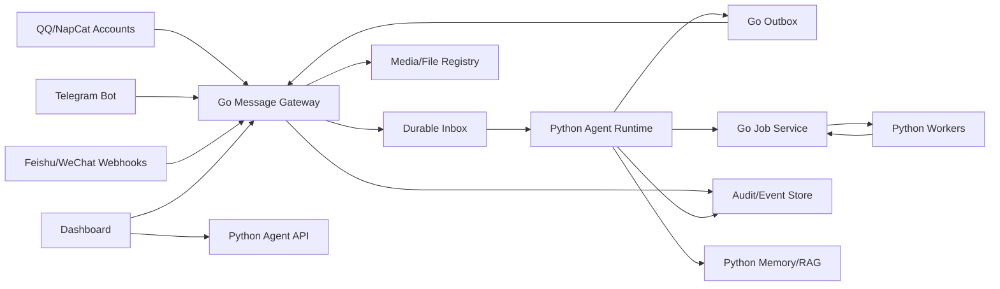
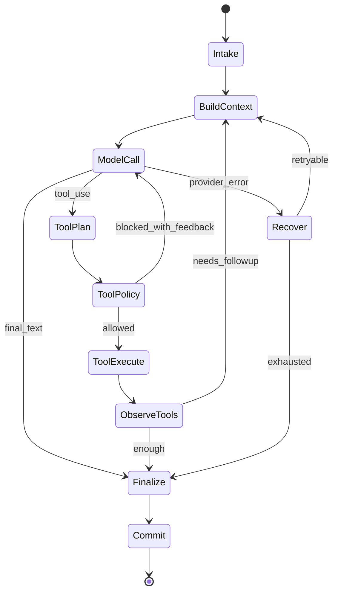

# SPEC-004: Target Agent Architecture

## Status

Draft

## Context

Akashic needs a clean agent architecture before adding more QQ group memory,
RAG, image generation, and multi-account automation. The target architecture
keeps agent intelligence flexible while moving infrastructure reliability to Go.

## High-Level Design



## Go Message Gateway

### Package Layout

The existing Go package layout stays:

```text
api
app
domain
infrastructure
trigger
types
```

### Domain Aggregates

| Aggregate | Responsibility |
| --- | --- |
| `ChannelAccount` | one logged-in platform account, including QQ number or Telegram bot id |
| `Conversation` | private/group/channel thread and its routing state |
| `MessageEnvelope` | normalized inbound message and attachments |
| `RoutingBinding` | maps platform/account/peer to an `AgentId` |
| `OutboxMessage` | durable outbound request and delivery state |
| `MediaAsset` | stable local or remote asset reference |
| `AgentJob` | long-running task, including image generation and RAG ingestion |
| `AuditEvent` | policy, routing, delivery, and trace metadata |

### Application Services

| Service | Inputs | Outputs |
| --- | --- | --- |
| `MessageIngestService` | platform event | normalized event, audit |
| `RoutingService` | envelope | target agent and session key |
| `LoopGuardService` | envelope + ledgers | allow/observe/drop |
| `OutboxService` | agent decision | delivery task |
| `MediaService` | platform attachment | asset id + preview URL |
| `JobService` | job command | job state + queue event |
| `GatewayQueryService` | dashboard query | messages/assets/jobs/audit |

## Python Agent Runtime

### Proposed Internal Layers

```text
agent_runtime
├── intake          # converts AgentInboundEvent to TurnInput
├── context_pipeline
├── turn_state      # named transitions and retry counters
├── reasoner        # provider/model calls
├── tool_runtime    # tool validation, policy, execution, result rendering
├── memory_runtime  # recall, extraction, consolidation, group memory, RAG
├── skills          # skill catalog, allowlists, lazy full-load
├── decision        # AgentDecision builder
└── workers         # image/RAG/memory jobs consumed from Go
```

### Turn State Machine



### Context Pipeline

The Python loop should be split into deterministic stages:

1. Load session window.
2. Attach current event and media summaries.
3. Retrieve memory/RAG.
4. Apply tool result budget.
5. Apply history compression.
6. Add stable core tools and deferred tool hints.
7. Build provider-specific request.

Each stage should be separately testable and produce a trace entry.

### Tool System

Adopt a stable tool surface:

- Core tools are always visible: message reply, memory recall, tool search,
  cancel/finish, and safe meta tools.
- Heavy or rarely used tools are deferred and invoked through a proxy executor.
- Tool permissions are checked before execution and recorded in audit.
- Tools that create durable side effects return structured side-effect requests,
  then Go performs platform delivery.

### Memory/RAG System

Memory stays Python-side, but ingestion is jobized by Go:

```text
QQ group message -> Go inbox -> Python observe turn
                 -> Go MemoryExtractJob
                 -> Python extractor/RAG worker
                 -> memory store + audit summary
```

For QQ group memory:

- Raw messages and assets are Go-owned.
- Extraction, summarization, embedding, dedupe, and retrieval are Python-owned.
- Group-specific memories are scoped by `agentId + groupId + topic`.
- RAG evaluation uses Python eval datasets and replayed Go audit events.

## Dashboard Architecture

Dashboard should query typed resources:

| UI Need | Owner |
| --- | --- |
| live platform messages | Go |
| clickable images/files | Go media registry |
| job progress | Go job service |
| agent reasoning trace | Python trace API mirrored to Go audit |
| memory facts and RAG eval | Python memory admin API |

## Anti-Shit-Mountain Rules

- No new file over 500 lines without an extraction plan.
- No platform SDK call inside `agent/core`.
- No LLM call inside Go gateway routing.
- No direct platform send from Python when a Go adapter exists.
- No new memory engine without declaring its store, lifecycle, and retrieval
  contract.
- Every new cross-module behavior needs an SDD spec and test list.

