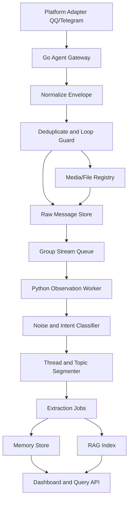

# SPEC-001: Group Message Processing Pipeline

## Status

Draft

## Context

QQ groups are noisy, fast-moving, multimodal, and socially sensitive. The goal
is not to make the bot reply more often. The first goal is observe-only
intelligence: collect, normalize, organize, and extract useful knowledge without
disturbing the group.

Target groups include hardware DIY groups and game communities, but the design
must also work for study, buying, support, and hobby groups.

## Goals

- Preserve raw group messages and attachments with stable ids.
- Turn noisy chat streams into searchable threads, topics, facts, guides, and
  decisions.
- Support image/file understanding without blocking live message ingestion.
- Keep reply decisions separate from observation and memory extraction.
- Make every transformation auditable from answer back to source message.

## Non-Goals

- Do not auto-reply in observed groups during the first implementation.
- Do not trust LLM-generated summaries without source links.
- Do not make RAG the only memory mechanism; group memory also needs temporal,
  social, procedural, and asset layers.

## Pipeline



## Stage Responsibilities

| Stage | Owner | Responsibility |
| --- | --- | --- |
| Platform ingest | Go | receive messages, login/account state, reconnect, retry |
| Normalize envelope | Go | convert platform payload into one schema |
| Deduplicate | Go | event id, message id, nonce, sender/account loop guard |
| Media/file registry | Go | download or link assets, store metadata, expose stable URLs |
| Raw message store | Go | immutable append-only group log |
| Stream queue | Go | durable fanout to workers with retry/dead-letter |
| Noise classifier | Python | decide whether message is chat/noise/question/answer/asset/guide/signal |
| Thread segmentation | Python | group messages into discussions by reply, time, entities, topic shift |
| Extraction | Python | facts, procedures, FAQs, decisions, product configs, summaries |
| RAG indexing | Python | chunking, embeddings, sparse index, reranker metadata |
| Memory serving | Python + Go | Python answers memory/RAG queries; Go serves raw sources/assets |

## Message Classes

The classifier should emit one or more classes:

| Class | Meaning | Example |
| --- | --- | --- |
| `noise` | greeting, emoji, short social chatter | "哈哈哈" |
| `question` | asks for help or recommendation | "B760M 配 13600KF 稳吗" |
| `answer` | gives concrete answer | "这板子供电够，散热注意一下" |
| `procedure` | step-by-step method | "先刷 BIOS，再开 XMP" |
| `fact` | stable claim | "某版本驱动会导致黑屏" |
| `decision` | group consensus or final choice | "最终买了 7800X3D + B650" |
| `asset` | image/file carries useful info | benchmark screenshot, config list |
| `deal` | price, sale, availability | "京东 4070S 4299" |
| `rumor` | uncertain unverified claim | "听说下周降价" |
| `moderation` | group rules/admin notices | pinned or admin message |

## Thread Segmentation

Use a hybrid strategy:

- direct reply relation when platform provides it;
- same sender + close time window for continuation;
- entity overlap, such as product names, game names, version numbers;
- embedding similarity for semantic continuation;
- punctuation and discourse markers for topic switches;
- hard split on long inactivity windows;
- merge small isolated answer messages into nearby question threads.

Every thread should keep:

```json
{
  "thread_id": "gqq:27234224:thread:uuid",
  "group_id": "27234224",
  "start_message_id": "qqmsg:1",
  "end_message_id": "qqmsg:20",
  "participants": ["1049511700", "2948770636"],
  "topics": ["hardware.cpu", "amd.7800x3d"],
  "message_ids": ["qqmsg:1", "qqmsg:2"],
  "asset_ids": ["asset:image:uuid"],
  "confidence": 0.82
}
```

## Extraction Outputs

Extraction should be typed, not just free-form summaries:

- `GroupFact`: stable claim with source messages.
- `GroupFAQ`: question, accepted answer, variants.
- `ProcedureMemory`: steps, prerequisites, warnings, source thread.
- `ProductConfigMemory`: parts, compatibility, price, rationale.
- `GameGuideMemory`: quest, character, map, strategy, version.
- `DecisionMemory`: selected option, alternatives, final reason.
- `AssetInsight`: OCR/vision/file summary with source asset id.
- `OpenQuestion`: unresolved problem that may need future monitoring.

## Backpressure Rules

- Go ingest must never block on Python extraction.
- Python workers consume durable jobs with bounded concurrency.
- Expensive image/file understanding is a separate job.
- If extraction fails, raw messages remain stored and replayable.
- Observe-only groups never emit outbound replies from this pipeline.

## Implementation Notes

- Initial Go raw-message ownership is implemented as `InboxEvent` in
  `services/agent-runtime`, with file-backed persistence configured by
  `AKASHIC_INBOX_DSN` or `AKASHIC_INBOX_PATH`.
- Current Python group-memory extraction still reads the compatibility session
  store. The next migration step is to consume `/v1/inbox` as the replay source
  while keeping extraction and RAG logic in Python.

## Security and Privacy

- Store group ids, sender ids, and asset ids explicitly.
- Redact tokens, phone numbers, and obvious secrets before LLM extraction.
- Do not expose private group files through unauthenticated public URLs.
- Dashboard asset links should be local authenticated routes or signed temporary
  URLs.
