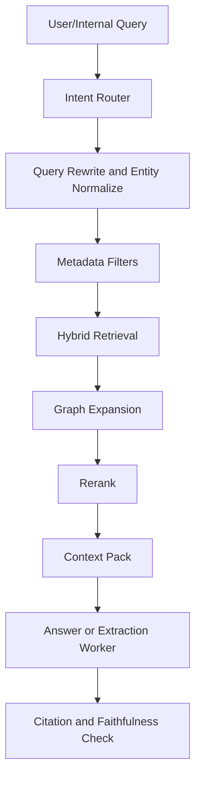

# SPEC-003: Group RAG Architecture

## Status

Draft

## Context

RAG is necessary for group memory, but it is not sufficient by itself. A good
group-memory system needs retrieval over raw messages, extracted facts, threads,
procedures, assets, and time-aware decisions. The RAG layer should be a
retrieval and grounding layer, not the whole memory system.

## Goals

- Answer questions about group history, hardware advice, game攻略, files, images,
  and unresolved discussions.
- Return citations that point back to source messages/assets.
- Prefer fresh and verified information without discarding older context.
- Support both owner queries and internal extraction/review workers.
- Be evaluable using replayed QQ-like datasets before production use.

## Retrieval Views

Create multiple retrieval views over the same source-backed memory:

| View | Data | Best For |
| --- | --- | --- |
| `raw_message` | short message chunks with author/time | exact quote, recent chatter |
| `thread_summary` | topic-window summaries | "what did they conclude?" |
| `semantic_fact` | extracted facts and claims | stable knowledge |
| `procedure` | steps, warnings, prerequisites | game攻略, troubleshooting |
| `asset_insight` | OCR/vision/file summaries | screenshots and docs |
| `entity_graph` | products, versions, games, people, relations | disambiguation and expansion |

## Indexing Strategy

Use a hybrid pipeline:

1. Normalize text:
   - Chinese segmentation;
   - product/model normalization (`RTX4070S`, `4070 Super`);
   - game/version aliases;
   - emoji/noise stripping when safe.
2. Chunk by thread and source type:
   - raw messages stay small;
   - thread summaries use parent-child references;
   - procedures are indexed by title, prerequisites, steps, warnings.
3. Build sparse index:
   - BM25 or equivalent keyword index;
   - exact-match fields for product names, group ids, versions, sender ids.
4. Build dense index:
   - embedding model configured independently from MiMo chat model;
   - store vector with source refs and validity metadata.
5. Optional late interaction / reranker:
   - rerank top candidates with a cross-encoder or LLM judge;
   - keep reranker swappable.
6. Store graph edges:
   - entity-to-memory;
   - contradiction/supersession;
   - procedure-to-version;
   - asset-to-message/thread.

## Query Pipeline

## Intent Types

| Intent | Retrieval Emphasis |
| --- | --- |
| `recent_summary` | time filter + thread summaries |
| `hardware_recommendation` | semantic facts + product configs + recent deals |
| `game_guide` | procedures + version metadata + asset insights |
| `troubleshooting` | procedures + Q/A + similar past issue threads |
| `file_or_image_lookup` | asset insights + exact metadata |
| `who_said_what` | raw messages + sender filter |
| `open_questions` | unresolved extracted questions |
| `trend_or_consensus` | thread summaries + decisions across time |

## Context Packing

The context pack sent to the answer model should include:

- top source snippets grouped by thread;
- memory record type and confidence;
- source message ids and asset ids;
- timestamp and freshness;
- conflict notes;
- missing-information note if retrieval is weak.

Do not send every raw message. Use parent-child packing:

- child result: exact message/procedure step that matched;
- parent context: thread summary or neighboring messages;
- cited source: raw message/asset id.

## Answer Rules

- Always cite sources for group-derived answers.
- If knowledge is version-sensitive, mention version/time.
- If sources conflict, say so and cite both sides.
- If retrieval confidence is low, answer as uncertain or ask for confirmation.
- For observe-only groups, RAG answers are sent only to the owner/private chat,
  never back into the group unless a later policy explicitly allows it.

## RAG Is Not Used For

- Bot-to-bot loop decisions.
- Platform routing.
- Permission decisions.
- Raw data retention.
- Replacing structured extraction.

## Go vs Python Boundary

| Concern | Owner |
| --- | --- |
| raw group events | Go |
| asset bytes and URLs | Go |
| RAG ingest job status | Go |
| text normalization for indexing | Python |
| embeddings and reranking | Python |
| graph/entity extraction | Python |
| source-message lookup by id | Go API |
| answer generation | Python |
| answer delivery | Go Outbox |

## Failure Handling

- If embedding provider is down, keep jobs pending or failed with retry state;
  do not drop raw messages.
- If reranker fails, fall back to hybrid retrieval with lower confidence.
- If source messages are missing, do not answer with uncited memory.
- If asset analysis fails, keep asset metadata and retry vision/OCR separately.

## Acceptance Tests

- Given a replayed group thread, retrieval returns the cited answer message in
  top-k for a related query.
- Given conflicting messages, answer includes conflict instead of choosing one
  silently.
- Given a game guide query, retrieval returns procedure records before random
  raw chat.
- Given a hardware build query, retrieval filters by budget/product/version when
  present.
- Given an image-only source, answer cites the asset insight and source asset id.

